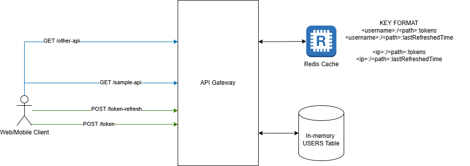

# API Gateway with Authentication + Rate Limiting
This project implements an API Gateway in spring boot that provides authentication and rate limiting features.
It uses a JWT-based authentication mechanism and integrates with a Redis cache for rate limiting.

## Index
- [Tech Stack](#tech-stack)
- [High Level Design](#high-level-design)
- [Low Level Design](#low-level-design)
- [Test Results](#test-results)
  - [Unit Tests](#unit-tests)
  - [Concurrency Tests](#concurrency-tests)
- [Running Application](#running-application)
  - [Using Docker](#using-docker)
  - [Configuration](#configuration)
  - [Postman Collection](#postman-collection)


## Tech Stack
1. Java 21
2. Spring Boot + Web 3.5.4
3. Redis 8.0.2
4. Spring Data Redis
5. Spring Security
6. JWT (Java JWT)
7. Lombok 
8. JUNIT 5 - For Unit Testing
9. Apache JMeter - For Concurrency Testing


## High Level Design

- For simplicity purpose, API gateway store users in memory. Following users are present by default:
  - Username: `johndoe` Password: `johndoe`
  - Username: `janedoe` Password `janedoe`
- There are two un-authenticated endpoints (highlighted in green) which are used to generate JWT tokens:
  - `/token` - Returns access token and refresh token for the user
  - `/token-refresh` - Returns new access and refresh for the user using refresh token
  - These endpoints are rate limited to 100 requests per minute using client IP address as the key.
- Pass through APIs are any paths which are authenticated (highlighted in blue)
- Authenticated APIs requires a valid JWT access token in the `Authorization` header.
- Authenticated APIs are rate limited to 100 requests per minute using username as the key.
- Username for authenticated APIs is extracted from valid JWT access token.
- For rate limiting, token bucket based algorithm is used.
- Rate limiting is implemented at userId/clientIp + API level.
- Rate limiting is also applied to un-authenticated endpoints to prevent abuse.

## Low Level Design
### Sequence for Authenticated API


### Sequence for Un-Authenticated API


### RateLimiterFilter
The `RateLimiterFilter` is a Spring Web filter that intercepts incoming requests and
applies rate limiting based on the configured strategy.

### RateLimitStrategy
The `RateLimitStrategy` interface defines the contract for rate limiting strategies.
It has a method `isQuotaExceeded` that checks if the request is allowed based on the rate limit configuration.

### TokenBucketRateLimitStrategy
The `TokenBucketRateLimitStrategy` is an implementation of the `RateLimitStrategy` interface
that uses the token bucket algorithm for rate limiting. It maintains a token bucket for each user or client IP address
and allows requests based on the available tokens in the bucket. For handling concurrent requests,
it uses Redis to store the token bucket state and ensures atomic operations using Redis transactions implemented using
LUA script.

### JWTAuthenticationFilter
The `JWTAuthenticationFilter` is a Spring Security filter that intercepts requests to authenticate users
using JWT tokens. It extracts the token from the `Authorization` header, validates it, and
sets the authentication in the security context if the token is valid.

### JWTAuthenticationProvider
The `JWTAuthenticationProvider` is a Spring Security authentication provider that validates JWT tokens.
It implements the `AuthenticationProvider` interface and checks if the provided token is valid.

### JWTAuthenticationConverter
The `JWTAuthenticationConverter` is a Spring Security converter that converts JWT tokens into
`Authentication` objects. It extracts the user details from the token and creates an `Authentication` object
that can be used by Spring Security.

### JWTAuthentication
The `JWTAuthentication` class represents the authentication token used in the application.
It implements the `Authentication` interface and contains the user details extracted from the JWT token.

### JWTService
The `JWTService` is a service that provides methods to create and validate JWT tokens.
It uses the `java-jwt` library to create tokens and validate them.
It also provides methods to extract user details from the token.

### AuthenticationService
The `AuthenticationService` is a service that provides methods to authenticate users and generate JWT tokens.
It uses the `JWTService` to create tokens and validate them.
It also provides methods to refresh tokens using the refresh token.

### AuthenticationController
The `AuthenticationController` is a Spring REST controller that provides endpoints for user authentication.
It has endpoints to create tokens and refresh tokens. It uses the `AuthenticationService` to handle
authentication logic. These endpoints are un-authenticated and rate limited to prevent abuse.

### CatchAllController
The `CatchAllController` is a Spring REST controller that handles all other requests that are not
handled by the authentication controller. This is useful for ensuring that all requests go through the API gateway.
These APIs are authenticated and rate limited based on the user ID extracted from the JWT token.

## Test Results
### Unit Tests
Unit tests are provided for the application using JUNIT 5.
You can run the tests using the following command:
```bash
./gradlew clean test
```
Jacoco code coverage report will be generated in `build/reports/jacoco/test/html/index.html`.

[Unit Test Reports](https://sidgawas.github.io/api-gateway/tests/test/)

[Code Coverage Report](https://sidgawas.github.io/api-gateway/jacoco/test/html/)

[RateLimiterFilter Coverage](https://sidgawas.github.io/api-gateway/jacoco/test/html/com.siddharthgawas.apigateway.ratelimiter/RateLimiterFilter.html)

[TokenBucketRateLimitStrategy Coverage](https://sidgawas.github.io/api-gateway/jacoco/test/html/com.siddharthgawas.apigateway.ratelimiter.impl/TokenBucketRateLimitStrategy.html)
### Concurrency Tests
Concurrency tests are provided to test the rate limiting feature for concurrent bursts of requests for same user
or from same client IP address. You can run the tests present in `perf_tests` folder using Apache JMeter.
<br><br>
The results of the concurrency tests are available in `perf_tests/burst_results.csv` file. In these tests the rate limit
was set to 5 request per minute and concurrent burst of 7 requests were sent for same user or from same client IP address.
The results show that the rate limiting is working as expected and the requests are being throttled after 5 requests.
<br><br>
Please see following table results of concurrency tests:

|timeStamp  |label               |responseCode|threadName                                 |success|
|-----------|--------------------|------------|-------------------------------------------|-------|
|1.75347E+12|Create Token        |429         |Un-authenticted User Burst Test 1-1        |FALSE  |
|1.75347E+12|Create Token        |429         |Un-authenticted User Burst Test 1-5        |FALSE  |
|1.75347E+12|Create Token        |201         |Un-authenticted User Burst Test 1-6        |TRUE   |
|1.75347E+12|Create Token        |201         |Un-authenticted User Burst Test 1-7        |TRUE   |
|1.75347E+12|Create Token        |201         |Un-authenticted User Burst Test 1-3        |TRUE   |
|1.75347E+12|Create Token        |201         |Un-authenticted User Burst Test 1-2        |TRUE   |
|1.75347E+12|Create Token        |201         |Un-authenticted User Burst Test 1-4        |TRUE   |
|||||
|1.75347E+12|Authenticated API -1|200         |Authenticated User Burst Test - API -1  2-6|TRUE   |
|1.75347E+12|Authenticated API -1|200         |Authenticated User Burst Test - API -1  2-3|TRUE   |
|1.75347E+12|Authenticated API -1|200         |Authenticated User Burst Test - API -1  2-4|TRUE   |
|1.75347E+12|Authenticated API -1|429         |Authenticated User Burst Test - API -1  2-2|FALSE  |
|1.75347E+12|Authenticated API -1|429         |Authenticated User Burst Test - API -1  2-5|FALSE  |
|1.75347E+12|Authenticated API -1|200         |Authenticated User Burst Test - API -1  2-1|TRUE   |
|1.75347E+12|Authenticated API -1|200         |Authenticated User Burst Test - API -1  2-7|TRUE   |
|||||
|1.75347E+12|Authenticated API -2|200         |Authenticated User Burst Test - API -2 3-6 |TRUE   |
|1.75347E+12|Authenticated API -2|200         |Authenticated User Burst Test - API -2 3-5 |TRUE   |
|1.75347E+12|Authenticated API -2|200         |Authenticated User Burst Test - API -2 3-7 |TRUE   |
|1.75347E+12|Authenticated API -2|429         |Authenticated User Burst Test - API -2 3-2 |FALSE  |
|1.75347E+12|Authenticated API -2|429         |Authenticated User Burst Test - API -2 3-1 |FALSE  |
|1.75347E+12|Authenticated API -2|200         |Authenticated User Burst Test - API -2 3-3 |TRUE   |
|1.75347E+12|Authenticated API -2|200         |Authenticated User Burst Test - API -2 3-4 |TRUE   |

## Running Application
### Using Docker
Docker compose file is provided to run the application along with Redis.
This is the recommended way to run the application for development and testing purposes.
1. Make sure you have Docker installed and running.
2. Run docker compose command to start the application and Redis:
   ```bash
   docker compose up -d
   ```
3. The application will be available at `http://localhost:8080`. Redis will be available at `redis://localhost:6379`.

### Configuration
You can configure the application by changing command line arguments in `docker-compose.yml` file.
- `application.secret`: Secret key used for signing JWT tokens
- `application.jwtAccessTokenExpirationMs`: Access token expiration time in milliseconds (default: 10 minutes)
- `application.jwtRefreshTokenExpirationMs`: Refresh token expiration time in milliseconds (default: 20 minutes)
- `application.maxReqPerMinute`: Maximum number of requests per minute for authenticated APIs (default: 100)

### Postman Collection
A Postman collection is provided to test the API Gateway.
You can import the collection from `postman/API gateway.postman_collection.json` file.


